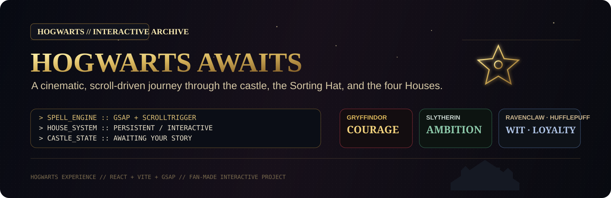

<p align="center">
  
</p>

<p align="center">
  <a href="https://harry-potter-d1e.pages.dev/">
    
  </a>
  
  
  
</p>

> A fan-made cinematic Hogwarts experience built with **React, Vite and GSAP**. Scroll through the castle, meet the Sorting Hat, discover your House, explore house-specific interactions, and finish beneath the stars of the Great Hall.

<p align="center">
  
</p>

## ✦ MAGIC // OVERVIEW

This project turns a traditional landing page into a **scroll-driven interactive story**. The experience opens with a cinematic Hogwarts sequence, transitions into an interactive Sorting Hat encounter, lets visitors explore all four Houses, and carries the selected House theme into the finale.

### What is inside

- **Cinematic Hogwarts hero** driven by GSAP + ScrollTrigger
- **Five scroll-reactive hero scenes** layered over a looping castle video
- **Interactive Sorting Hat** with animated dialogue and randomized House reveal
- **Persistent House selection** stored locally so the choice survives a revisit
- **Four interactive House cards** with dedicated themes, particles and details
- **House reveal overlays**, cursor effects and contextual visual changes
- **Great Hall finale** that adapts to the selected House
- **Loading screen, magical particle field and custom navigation**
- **Reduced-motion support** for visitors who prefer less animation
- Responsive keyboard-accessible controls for core interactions

<p align="center">
  
</p>

## ✦ JOURNEY // EXPERIENCE FLOW

| Chapter | Experience | Interaction |
|---|---|---|
| **01 · Hogwarts Awaits** | Mist, castle atmosphere and cinematic storytelling | Scroll-driven scene transitions |
| **02 · Sorting Ceremony** | Candles, fog and the Sorting Hat | Click / keyboard activation |
| **03 · House Reveal** | Randomized House assignment | Animated reveal + persistent theme |
| **04 · House Discovery** | Gryffindor, Slytherin, Ravenclaw and Hufflepuff | Select, inspect and change House |
| **05 · Great Hall** | Star field and House-aware finale | Dynamic closing message |

<p align="center">
  
</p>

<p align="center">
  
</p>

## ✦ SORTING HAT // HOUSE SYSTEM

The Sorting Hat is more than a visual section. It runs a complete interaction sequence:

```text
IDLE
  ↓
"Hmm..."
  ↓
"Difficult."
  ↓
"Very difficult."
  ↓
HOUSE SELECTED
  ↓
REVEAL
  ↓
THEME PERSISTED
```

The selected House is saved through `localStorage`, and the root document receives a matching `data-house` attribute. That lets the broader interface respond to the visitor's House while still allowing the selection to be cleared or changed.

<details>
<summary><strong>GRYFFINDOR // Courage</strong></summary>
<br />
A warm red-and-gold visual direction with a bold, heroic mood.
</details>

<details>
<summary><strong>SLYTHERIN // Ambition</strong></summary>
<br />
A darker green treatment with serpentine visual language and a colder magical atmosphere.
</details>

<details>
<summary><strong>RAVENCLAW // Wisdom</strong></summary>
<br />
A blue, star-led treatment featuring constellation-style details and a more celestial mood.
</details>

<details>
<summary><strong>HUFFLEPUFF // Loyalty</strong></summary>
<br />
A warm yellow-and-earth visual treatment with a softer, grounded character.
</details>

<p align="center">
  
</p>

## ✦ SPELLBOOK // TECHNOLOGY

```yaml
core:
  framework: React 19
  bundler: Vite 8
  animation: GSAP 3
  styling: CSS

interaction:
  - GSAP ScrollTrigger
  - scroll-pinned hero storytelling
  - animated Sorting Hat sequence
  - house-specific particle systems
  - custom cursor trails
  - modal-style house details
  - animated house reveal
  - localStorage theme persistence

experience:
  - responsive layouts
  - keyboard interaction
  - reduced-motion handling
  - cinematic video hero
  - dynamic finale state
```

<p align="center">
  
</p>

## ✦ ARCHITECTURE // KEY COMPONENTS

| Component | Purpose |
|---|---|
| `Hero.jsx` | ScrollTrigger-driven cinematic opening with five narrative scenes |
| `Section1.jsx` | Interactive Sorting Hat ceremony and House assignment |
| `Section2.jsx` | House selection, house cards, cursor effects, details and reveal flow |
| `Finale.jsx` | House-aware Great Hall ending and project footer |
| `MagicField.jsx` | Global magical atmosphere layer |
| `ParticleLayer.jsx` | Contextual house particle effects |
| `CursorTrail.jsx` | House-aware pointer effects |
| `useHouseTheme.js` | House state + localStorage persistence |

<p align="center">
  
</p>

## ✦ LOCAL ACCESS // RUN THE CASTLE

```bash
# clone the repository
git clone https://github.com/vaikashhari/Harry-Potter.git

# enter the project
cd Harry-Potter

# install dependencies
npm install

# start the development server
npm run dev

# production build
npm run build

# preview the production build
npm run preview
```

### Live deployment

**Cloudflare Pages:**  
https://harry-potter-d1e.pages.dev/

<p align="center">
  
</p>

## ✦ ENCHANTMENTS // ACCESSIBILITY & EXPERIENCE

The animation layer checks `prefers-reduced-motion`, and the Sorting Hat / House controls support keyboard activation. The hero experience is also designed so a delayed or failed video request does not disable the scroll interaction.

The project separates the story into focused React components, keeping the cinematic behavior, House logic and theme state modular rather than placing the entire experience in a single page component.

<p align="center">
  
</p>

## ✦ CREDITS // PROJECT

<p align="center">
  <strong>Built by Creatary Labs</strong><br />
  <sub>Interactive web experiment · 2026</sub>
</p>

## ✦ NOTICE // FAN PROJECT

> This is an **unofficial, non-commercial Harry Potter-inspired fan project** created as a web-design and front-end development experiment. Harry Potter, Hogwarts, the House names and related marks belong to their respective rights holders. This project is not affiliated with or endorsed by the official franchise rights holders.

---

<p align="center">
  <strong>HOGWARTS // INTERACTIVE EXPERIENCE</strong><br />
  <sub>Mischief managed. The castle is waiting.</sub>
</p>
